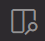
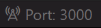

# ☑️📃TODO List

A simple CRUD todo list web app created using HTML, CSS & JavaScript.

### 🚧 **In Progress** 🚧 ###

## Table of Contents
- [Features](#features)
- [Preview](#preview)
- [Getting Started](#getting-started)
- [Technologies Used](#technologies-used)

## Features

### 📝Add todos
Add todos using the "Add Todo" button.
### ✏️Edit todos
Edit individual todos using the edit icon. Press enter to confirm changes. Changes persist in local storage.
### 🗑️Delete todos
Delete individual todos. Changes persist in local storage.
### 🧹Clear todo list
Remove all todos from your list with a single click. This will reflect in local storage.
### 💾Todo local storage
All todos are stored in local storage, and are loaded in whenever you open the webpage.<br>Local storage is browser-exclusive however, so stored todos will not be seen in a different browser.
### 📱Responsive design
Your todo list auto-updates in response to adding/deleting/editing todos.

## Preview


*<br>Add todos*


*<br>Edit todos*


*<br>Delete todos* 


*<br>Clear todos* 


*<br>Todos saved to local storage* 


**Try the app out for yourself** --> (coming soon)

## Getting Started
This project doesn't require any prerequisites or installations of any kind since its runs on vanilla HTML, CSS and JavaScript.

### Steps

1. Clone the repository.
   ```bash
   git clone https://github.com/thetireddude/interactive-todo-list.git
   ```
   You can also download the project zip file.


2. Open the project folder in VS Code.

3. Open "Live Preview" or start a "Live Server" for the webpage. These VS Code extensions need to be installed previously.

4. For live preview, click on the preview icon.<br><br> <br><br>If you started a live server, visit http://localhost:3000.<br>Note that your port (eg. 3000) may be different. To find your port, go to your VS Code status bar and hover over the Live Server icon.<br><br> 

## Technologies Used

### Frontend
- Vanilla JS
- CSS
- HTML5

### Tools & Services
- Git & GitHub
- VS Code
- Deployment platform (Coming Soon❕)

---

⭐ If you found this project helpful, please give it a star on GitHub!